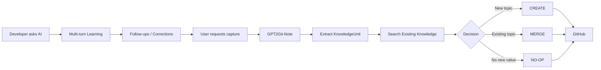

<div align="center">

# 🧠 GPT2Git-Note

### Turn AI conversations into a Git-native developer learning memory

**Chat → Follow-up → Misconception → Mental Model → Git**

<p>
  
  
  
  
</p>

**Don't save the chat. Save how you learned.**

**English** · [简体中文](README.md)

[Quick Start](#-quick-start) · [How It Works](#-how-it-works) · [Before / After](#-before--after) · [Design Principles](#-design-principles) · [Roadmap](#-roadmap)

</div>

---

## ✨ What is GPT2Git-Note?

GPT2Git-Note is an Agent Skill for developers who learn through AI conversations.

Ask about Java, databases, distributed systems, Agent engineering, RAG, algorithms, or any other technical topic the way you normally would. Keep asking follow-up questions until the concept actually makes sense. Then say one thing:

```text
capture this
```

GPT2Git-Note compiles that learning path into durable knowledge and maintains it in your GitHub repository.

It does not store a raw chat log. It stores a structured learning unit:

```text
KnowledgeUnit
├── Primary Question
├── Core Answer
├── Follow-ups[]          ⭐
├── Misconceptions[]      ⭐
├── Corrections[]
├── Final Mental Model
├── Interview Answer?
└── Related Topics[]
```

> **The valuable part is not only the correct answer. It is where you got stuck, what you asked next, and which explanation finally made the idea click.**

---

## 💡 Why?

More and more developers learn like this:

```text
Why does Spring transaction self-invocation fail?
        ↓
AI gives the first explanation
        ↓
But if I entered through the Proxy, why is `this` still the Target?
        ↓
clarification
        ↓
Then why does dependency injection expose the Proxy?
        ↓
another clarification
        ↓
finally: a complete mental model
```

Traditional approaches usually fail in one of four ways:

| Approach | Problem |
|---|---|
| Save only the final AI answer | Loses the follow-ups that exposed the real knowledge gap |
| Export the full conversation | Too noisy to review later |
| Manually rewrite notes in Obsidian / Notion | Adds a second round of work after learning |
| Create one Markdown file per conversation | Quickly produces fragmented, duplicated notes |

GPT2Git-Note takes a different approach:

> **Let AI compile the learning process into knowledge. Let Git preserve and evolve it.**

---

## 🔥 Before / After

### ❌ Raw chat export

```text
User: Why doesn't this.b() trigger @Transactional?
Assistant: Because Spring AOP...

User: But I already entered a() through the Proxy. Why isn't `this` the Proxy?
Assistant: Because the actual method body still runs on the Target...

User: Then why does @Autowired give me the Proxy?
Assistant: Because Spring ultimately exposes the wrapped bean...
```

Months later, you have to reread the whole transcript to reconstruct the reasoning.

### ✅ GPT2Git-Note

```markdown
# Why Spring Transaction Self-Invocation Fails

## 1. Primary Question
Why doesn't calling this.b() inside the same class trigger @Transactional?

## 2. Core Answer
@Transactional relies on Spring AOP proxies.
Only calls that pass through the Proxy receive transaction interception.

## 3. My Follow-ups ⭐

### If I entered a() through the Proxy, why is `this` still the Target?
The Proxy intercepts and forwards the call, but the method body itself executes on the Target.

### Then why does dependency injection expose the Proxy?
After AOP wrapping, Spring exposes the proxy object to external callers.

## 4. My Previous Misconception

❌ Once a call enters through the Proxy, `this` inside a() should also be the Proxy.

✅ The method body executes on the Target, so `this == Target`.

## 5. Final Mental Model

Caller → Proxy → Target.a()
                  ↓
              this == Target
                  ↓
              Target.b()

## 6. Interview Answer
...
```

See the full example: [`examples/spring-transaction-self-invocation.md`](examples/spring-transaction-self-invocation.md)

---

## ⚡ Quick Start

### 1. Learn normally

Do not change how you ask questions:

```text
Why is Kafka throughput so high?
```

Keep going:

```text
Why is sequential I/O faster here?
What exactly does the page cache do?
Which memory copies does zero-copy eliminate?
If storage is already fast, where does the bottleneck move next?
```

### 2. Once the concept is clear, say

```text
capture this
```

The Skill can also respond to equivalent capture intent such as `save this`, `add this to my notes`, or `store this in GitHub`.

### 3. GPT2Git-Note maintains the repository

```text
Current learning conversation
          ↓
Extract KnowledgeUnit
          ↓
Search existing Git knowledge
          ↓
┌──────────┬──────────┬──────────┐
│  CREATE  │  MERGE   │  NO-OP   │
└──────────┴──────────┴──────────┘
          ↓
Update Markdown
          ↓
GitHub Commit
```

No second manual note-taking pass is required.

---

## 🧭 How It Works



GPT2Git-Note treats GitHub as a **persistence layer**, not merely an export destination:

```text
Markdown     = Knowledge
Git History  = Knowledge Evolution
GitHub       = Persistence
AI Runtime   = Reasoning + Execution
Skill        = Knowledge Curator
```

V1 requires no custom database, vector store, or synchronization service.

---

## ⭐ The Core Difference: Follow-ups Are First-Class Data

Most AI note workflows look like this:

```text
Question → Final Answer
```

GPT2Git-Note cares more about the reasoning path:

```text
Question
   ↓
Initial Answer
   ↓
Follow-up ⭐
   ↓
Misconception exposed ⭐
   ↓
Clarification
   ↓
Another Follow-up ⭐
   ↓
Final Mental Model
```

When compression is necessary, the default priority is:

```text
1. Follow-ups + the answers that resolved them
2. Misconceptions + corrections
3. Final mental model
4. Primary question + core answer
5. Supplementary examples
```

Because the most personal part of your knowledge is often not the definition itself. It is:

> **the exact point where your understanding broke down.**

---

## 🔀 Git-Native Merge

GPT2Git-Note does **not** default to one file per conversation.

Before writing, it searches the existing repository and chooses one operation:

| Operation | When |
|---|---|
| **CREATE** | No existing topic can reasonably absorb the new knowledge |
| **MERGE** | The conversation deepens an existing topic |
| **NO-OP** | The repository already contains the useful knowledge |

### ❌ Note explosion

```text
spring-transaction.md
spring-transaction-2.md
spring-transaction-final.md
spring-transaction-2026-08-30.md
```

### ✅ Evolving knowledge

```text
knowledge/java/spring.md

## Spring Transactions
├── Self-invocation
├── rollbackFor
├── Propagation
└── Common failure modes
```

Git commits can also become knowledge revisions:

```text
knowledge: add Spring transaction basics
knowledge: capture proxy-vs-target follow-up
knowledge: clarify self-invocation mental model
```

---

## 📦 Installation

GPT2Git-Note works with Agent runtimes that can load `SKILL.md`. Automatic persistence additionally requires GitHub read/write capability in that runtime.

### Generic Agent Skills directory

```bash
git clone https://github.com/pogacar03/GPT2Git-Note.git \
  ~/.agents/skills/gpt2git-note
```

### Claude Code-style directory

```bash
git clone https://github.com/pogacar03/GPT2Git-Note.git \
  ~/.claude/skills/gpt2git-note
```

### Other AI runtimes

```text
Load SKILL.md
→ allow GitHub read / search / write actions
→ choose a target knowledge repository
```

> Without GitHub write access, GPT2Git-Note may still produce the compiled KnowledgeUnit, but it must not claim that a commit succeeded.

---

## 🧩 Design Principles

| Principle | Meaning |
|---|---|
| 🧠 Preserve cognition | Keep why the learner got stuck and how the misunderstanding was resolved |
| ⭐ Follow-ups first | User follow-up questions are first-class knowledge |
| 🔀 Merge before create | Search first and evolve existing knowledge when possible |
| 🔒 Never invent | Do not fabricate misconceptions, experience, measurements, or facts |
| ✅ Verify Git writes | Only report a successful commit after the write succeeds |
| 🧱 No backend by default | V1 reuses the Agent runtime and GitHub instead of adding another persistence stack |

---

## 🎯 V1 Scope

GPT2Git-Note intentionally does not require:

- MCP Server
- custom backend
- SQL database
- vector database
- browser extension
- background sync service

V1 tests one core hypothesis:

> **Can one explicit capture command turn a valuable AI learning loop into a clean, evolving GitHub knowledge base?**

---

## 🗺️ Roadmap

- [x] Git-native KnowledgeUnit
- [x] Follow-up-first capture priority
- [x] CREATE / MERGE / NO-OP
- [x] English / 简体中文 README
- [ ] Knowledge mastery / weak-point tracking
- [ ] Review mode generated from historical misconceptions
- [ ] PR mode for team knowledge bases
- [ ] Automatic related-topic linking
- [ ] Knowledge evolution visualization from Git history
- [ ] Cross-runtime MCP layer
- [ ] More README languages

---

<div align="center">

### 🧠 GPT2Git-Note

**Don't save the chat. Save how you learned.**

**English** · [简体中文](README.md)

</div>
