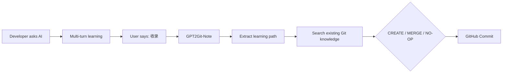

<div align="center">

# 🧠 GPT2Git-Note

### Turn developer AI conversations into a Git-native learning memory

**Chat → Follow-ups → Misconceptions → Mental Model → Git**


**Your knowledge stays in your Git.**

</div>

---

## Why GPT2Git-Note

Developers increasingly learn through conversations with AI:

```text
Why does Spring transaction self-invocation fail?
        ↓
first explanation
        ↓
But why is `this` still Target after entering through Proxy?
        ↓
second explanation
        ↓
Then why does dependency injection expose Proxy instead of Target?
        ↓
finally understood
```

Most note tools keep only the final answer or export the entire transcript.

GPT2Git-Note keeps the part that is usually lost:

> **the learner's follow-up questions, misconceptions, corrections, and final mental model.**

Then it maintains that knowledge directly in GitHub.

---

## Core Idea



GitHub is not merely an export destination. It is the persistence layer.

```text
Markdown    = Knowledge
Git history = Knowledge evolution
GitHub      = Persistence
AI runtime  = Reasoning + execution
Skill       = Knowledge curator
```

No custom backend is required for V1.

---

## What Gets Captured

```text
KnowledgeUnit
├── Primary Question
├── Core Answer
├── Follow-ups[]          ⭐
├── Misconceptions[]      ⭐
├── Corrections[]
├── Final Mental Model
├── Interview Answer?
└── Related Topics[]
```

The highest-priority information is not generic textbook content. It is the reasoning that explains **why the learner got stuck**.

---

## Example

Instead of storing this:

```text
User: Why does this.b() bypass @Transactional?
Assistant: ...
User: But why isn't this the Proxy?
Assistant: ...
User: Why is Proxy injected?
Assistant: ...
```

GPT2Git-Note compiles it into:

```markdown
# Spring 事务自调用为什么失效

## 原始问题
...

## 核心回答
...

## 我的追问 ⭐
### 为什么已经从 Proxy 进了 a()，this 还是 Target？
...

### 为什么依赖注入拿到的是 Proxy？
...

## 我曾经的错误理解
...

## 最终心智模型
Caller → Proxy → Target
Target 内部自调用 → Target

## 面试回答
...
```

See the full example: [`examples/spring-transaction-self-invocation.md`](examples/spring-transaction-self-invocation.md)

---

## Git-Native Merge

GPT2Git-Note does not create one Markdown file per conversation.

Before writing, it searches the target repository and decides:

| Operation | Meaning |
|---|---|
| **CREATE** | No existing topic can absorb the knowledge |
| **MERGE** | The conversation deepens an existing topic |
| **NO-OP** | The useful knowledge is already present |

Bad:

```text
spring-transaction.md
spring-transaction-2.md
spring-final.md
spring-transaction-2026-08-30.md
```

Preferred:

```text
knowledge/java/spring.md

## Spring 事务
### 自调用失效
### 传播机制
### rollbackFor
```

---

## Default Developer Taxonomy

When the user does not already have a knowledge structure:

```text
knowledge/
├── java/
│   ├── java-base.md
│   ├── jvm.md
│   ├── juc.md
│   └── spring.md
├── database/
│   ├── mysql.md
│   └── redis.md
├── middleware/
│   ├── kafka.md
│   └── mq.md
├── distributed-system/
│   └── fundamentals.md
├── ai/
│   ├── rag.md
│   ├── agent.md
│   ├── mcp.md
│   └── sandbox.md
└── algorithm/
    └── patterns.md
```

If a repository already has a coherent taxonomy, GPT2Git-Note follows it instead of forcing this tree.

---

## Installation

### Generic Agent Skills directory

```bash
git clone https://github.com/pogacar03/GPT2Git-Note.git \
  ~/.agents/skills/gpt2git-note
```

### Claude Code style directory

```bash
git clone https://github.com/pogacar03/GPT2Git-Note.git \
  ~/.claude/skills/gpt2git-note
```

### Any runtime with project/system instructions

Load [`SKILL.md`](SKILL.md) as the behavior instruction and allow the runtime to read the `references/` directory as needed.

The runtime also needs GitHub read/write capability if you want automatic persistence.

---

## Quick Start

Learn normally first:

```text
为什么 Spring 的 this.b() 不走事务？
```

Keep asking until you actually understand it.

Then say:

```text
收录
```

The expected behavior is:

```text
1. Select the relevant learning window
2. Extract question + answer + follow-ups + corrections
3. Search the GitHub knowledge repository
4. CREATE / MERGE / NO-OP
5. Write and verify
6. Return the changed path and verified commit result
```

---

## Design Principles

### Follow-ups are first-class data

A follow-up such as:

> “外部已经从 Proxy 进来了，为什么 this 还是 Target？”

is usually more valuable for future review than another generic definition of AOP.

### Never invent misconceptions

If the user never expressed a wrong model, the note must not fabricate one for completeness.

### Never raw-export chat

Stored knowledge should read like a durable learning artifact, not a message log.

### Never fake Git success

GPT2Git-Note may only report `已提交` after the GitHub write succeeds.

### Existing knowledge wins over new files

A meaningful merge is preferred over note proliferation.

---

## Repository Structure

```text
GPT2Git-Note/
├── SKILL.md
├── references/
│   ├── knowledge-schema.md
│   ├── github-merge-protocol.md
│   └── developer-taxonomy.md
├── examples/
│   └── spring-transaction-self-invocation.md
├── tests/
│   └── skill-evals.md
├── docs/
│   └── superpowers/
│       └── specs/
├── CHANGELOG.md
└── README.md
```

---

## V1 Scope

GPT2Git-Note intentionally does **not** require:

- MCP Server
- custom backend
- SQL database
- vector database
- browser extension
- background synchronization service

V1 tests one simple hypothesis:

> Can one explicit `收录` command turn a useful AI learning loop into a clean, evolving GitHub knowledge base?

If cross-client support becomes important later, the Git operations and knowledge protocol can be extracted into MCP without changing the core knowledge model.

---

## Testing

Behavioral pressure scenarios live in [`tests/skill-evals.md`](tests/skill-evals.md).

Release-blocking failures include:

- losing meaningful follow-ups;
- inventing misconceptions;
- creating duplicate notes instead of merging;
- storing raw transcripts;
- claiming an unverified GitHub commit.

---

## Roadmap

- [ ] Knowledge mastery / weak-point tracking
- [ ] Review mode: generate questions from stored misconceptions
- [ ] PR mode for team knowledge bases
- [ ] Cross-runtime MCP layer
- [ ] Automatic related-topic linking
- [ ] Knowledge evolution visualization from Git history

---

<div align="center">

### GPT2Git-Note

**Don't save the chat. Save how you learned.**

</div>
