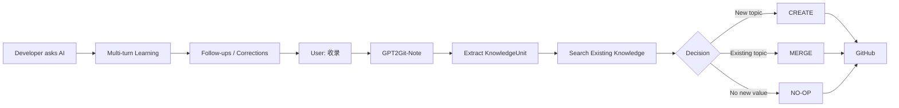

<div align="center">

# 🧠 GPT2Git-Note

### Turn AI conversations into a Git-native developer learning memory.

**Chat → Follow-up → Misconception → Mental Model → Git**

<p>
  
  
  
  
</p>

**Don't save the chat. Save how you learned.**

[Quick Start](#-quick-start) · [How It Works](#-how-it-works) · [Example](#-before--after) · [Design](#-design-principles) · [Roadmap](#-roadmap)

</div>

---

## ✨ What is GPT2Git-Note?

GPT2Git-Note 是一个面向 **Java Backend / AI Backend / Agent / RAG / Distributed Systems** 学习场景的 Agent Skill。

你像平常一样和 AI 讨论技术问题、不断追问，直到真正理解。最后只需要说一句：

```text
收录
```

GPT2Git-Note 会把这段学习过程整理成可长期维护的知识，并写入你的 GitHub Repository。

它保存的不是聊天记录，而是：

```text
KnowledgeUnit
├── Primary Question
├── Core Answer
├── Follow-ups[]          ⭐
├── Misconceptions[]      ⭐
├── Corrections[]
├── Final Mental Model
├── Interview Answer?
└── Related Topics[]
```

> **真正值得保存的，不只是“正确答案”，还有你为什么没懂、你追问了什么、哪个解释最终让你理解。**

---

## 💡 Why?

越来越多开发者已经不是通过“先打开笔记软件”来学习，而是这样：

```text
为什么 Spring 事务自调用会失效？
        ↓
AI 给出第一次解释
        ↓
但我明明是从 Proxy 进来的，为什么 this 还是 Target？
        ↓
继续解释
        ↓
那为什么依赖注入拿到的又是 Proxy？
        ↓
继续追问
        ↓
终于形成完整心智模型
```

传统做法通常走向两个极端：

| 方式 | 问题 |
|---|---|
| 保存 AI 最终答案 | 丢掉了真正暴露认知缺口的追问过程 |
| 导出整段 Chat | 信息密度低，之后几乎不会重新阅读 |
| 手动整理 Obsidian / Notion | 学习结束以后还要再做一遍“笔记劳动” |
| 每次生成一个 Markdown | 最后得到大量重复、碎片化文件 |

GPT2Git-Note 的思路是：

> **让 AI 在学习结束后，把“认知过程”编译成知识；让 Git 负责长期保存和演化。**

---

## 🔥 Before / After

### ❌ Raw chat export

```text
User: Spring 的 this.b() 为什么不走事务？
Assistant: 因为 Spring AOP...

User: 但是我已经从 Proxy 进入 a() 了，为什么 this 不是 Proxy？
Assistant: 因为真正执行 a() 的对象还是 Target...

User: 那为什么 Autowired 拿到的是 Proxy？
Assistant: 因为 BeanPostProcessor 最终暴露的是代理对象...
```

几个月以后重新打开，很难快速恢复当时的认知路径。

### ✅ GPT2Git-Note

```markdown
# Spring 事务自调用为什么失效

## 1. 原始问题
为什么同一个类内部 this.b() 不会触发 @Transactional？

## 2. 核心回答
@Transactional 依赖 Spring AOP Proxy。
只有经过 Proxy 的调用才会执行事务增强。

## 3. 我的追问 ⭐

### 为什么已经从 Proxy 进入 a()，this 还是 Target？
Proxy 只是负责把调用转发给 Target。
真正执行 a() 方法体的对象仍然是 Target，因此 this == Target。

### 为什么依赖注入拿到的却是 Proxy？
Spring 完成 BeanPostProcessor / AOP 包装后，向外暴露的是代理对象。

## 4. 我曾经的错误理解

❌ 从 Proxy 进入 a() 后，a() 内部的 this 应该也是 Proxy。

✅ Proxy 负责拦截和转发，但方法体最终在 Target 上执行。

## 5. 最终心智模型

Caller → Proxy → Target.a()
                  ↓
              this == Target
                  ↓
              Target.b()

## 6. 面试回答
...
```

完整示例见 [`examples/spring-transaction-self-invocation.md`](examples/spring-transaction-self-invocation.md)。

---

## ⚡ Quick Start

### 1. 正常学习

不用改变你的提问习惯：

```text
为什么 Kafka 吞吐量高？
```

继续追问：

```text
顺序写到底为什么快？
Page Cache 在这里干什么？
那零拷贝到底少了哪几次复制？
如果磁盘已经很快了，瓶颈会转移到哪里？
```

### 2. 学明白以后说一句

```text
收录
```

### 3. GPT2Git-Note 执行

```text
当前学习对话
      ↓
提取 KnowledgeUnit
      ↓
搜索 GitHub 现有知识
      ↓
┌──────────┬──────────┬──────────┐
│  CREATE  │  MERGE   │  NO-OP   │
└──────────┴──────────┴──────────┘
      ↓
更新 Markdown
      ↓
GitHub Commit
```

你不需要在学习结束后再手动整理一次笔记。

---

## 🧭 How It Works



GPT2Git-Note 把 GitHub 当作 **Persistence Layer**，而不仅仅是一个导出目标：

```text
Markdown     = Knowledge
Git History  = Knowledge Evolution
GitHub       = Persistence
AI Runtime   = Reasoning + Execution
Skill        = Knowledge Curator
```

V1 不需要自建数据库，也不需要额外服务。

---

## ⭐ The Core Difference: Follow-ups Are First-Class Data

多数 AI Note 工具最重视：

```text
Question → Final Answer
```

GPT2Git-Note 更重视：

```text
Question
   ↓
Initial Answer
   ↓
Follow-up ⭐
   ↓
Misconception exposed ⭐
   ↓
Clarification
   ↓
Another Follow-up ⭐
   ↓
Final Mental Model
```

当内容必须压缩时，默认优先级是：

```text
1. Follow-ups + resolved answers
2. Misconceptions + corrections
3. Final mental model
4. Primary question + core answer
5. Supplementary examples
```

因为真正属于你的知识，不是网上随处可见的定义，而是：

> **你到底在哪一步卡住过。**

---

## 🔀 Git-Native Merge

GPT2Git-Note **不会默认一轮对话创建一个文件**。

每次写入之前，它先搜索已有知识，再决定：

| Operation | When |
|---|---|
| **CREATE** | 没有合适的已有知识可以承载这次内容 |
| **MERGE** | 新对话深化了已经存在的知识点 |
| **NO-OP** | 新对话没有带来新的有效知识 |

### ❌ Note Explosion

```text
spring-transaction.md
spring-transaction-2.md
spring-transaction-final.md
spring-transaction-2026-08-30.md
```

### ✅ Evolving Knowledge

```text
knowledge/java/spring.md

## Spring 事务
├── 自调用失效
├── rollbackFor
├── 传播机制
└── 事务失效场景
```

Git Commit 本身也变成了认知版本：

```text
knowledge: add Spring transaction basics
knowledge: capture proxy-vs-target follow-up
knowledge: clarify self-invocation mental model
```

---

## 🗂️ Default Developer Taxonomy

如果你的知识仓库还没有自己的目录结构，GPT2Git-Note 可以采用默认分类：

```text
knowledge/
├── java/
│   ├── java-base.md
│   ├── jvm.md
│   ├── juc.md
│   └── spring.md
│
├── database/
│   ├── mysql.md
│   └── redis.md
│
├── middleware/
│   ├── kafka.md
│   └── mq.md
│
├── distributed-system/
│   └── fundamentals.md
│
├── ai/
│   ├── rag.md
│   ├── agent.md
│   ├── mcp.md
│   └── sandbox.md
│
└── algorithm/
    └── patterns.md
```

如果用户已有稳定的知识结构，Skill 会优先遵循现有结构，而不是强行迁移。

---

## 📦 Installation

GPT2Git-Note 适用于能够读取 `SKILL.md`、并拥有 GitHub 读写能力的 Agent Runtime。

### Generic Agent Skills

```bash
git clone https://github.com/pogacar03/GPT2Git-Note.git \
  ~/.agents/skills/gpt2git-note
```

更新：

```bash
cd ~/.agents/skills/gpt2git-note
git pull
```

### Claude Code-style directory

```bash
git clone https://github.com/pogacar03/GPT2Git-Note.git \
  ~/.claude/skills/gpt2git-note
```

### Other AI runtimes

如果运行环境支持 Project Instructions / Agent Skills：

```text
Load SKILL.md
→ allow GitHub read/search/write actions
→ choose a target knowledge repository
```

> GitHub 自动持久化能力取决于具体运行环境是否提供 GitHub 写入工具。没有写权限时，Skill 仍应生成整理后的 KnowledgeUnit，但不能声称已经 Commit。

---

## 🧩 Design Principles

<table>
<tr>
<td width="50%" valign="top">

### 🧠 Preserve cognition

保存“为什么没懂”和“怎么搞懂”，而不只是最终定义。

</td>
<td width="50%" valign="top">

### ⭐ Follow-ups first

用户追问是一等数据，不应该在摘要过程中被压掉。

</td>
</tr>
<tr>
<td width="50%" valign="top">

### 🔀 Merge before create

先搜索，再决定是否创建新知识，避免 Markdown 爆炸。

</td>
<td width="50%" valign="top">

### 🔒 Never invent

没有表达过的误解、经历、数据，不能为了“笔记完整”而杜撰。

</td>
</tr>
<tr>
<td width="50%" valign="top">

### ✅ Verify Git writes

GitHub 写入成功以后才能说“已提交”。

</td>
<td width="50%" valign="top">

### 🧱 No backend by default

V1 直接利用 Agent + GitHub，不重复造数据库和同步服务。

</td>
</tr>
</table>

---

## 🆚 GPT2Git-Note vs Traditional Notes

| | Traditional Notes | Chat Export | GPT2Git-Note |
|---|---:|---:|---:|
| 自动整理 | ❌ | ✅ | ✅ |
| 保存最终答案 | ✅ | ✅ | ✅ |
| 保存关键追问 | 手动 | ✅ 但噪声大 | **✅ First-class** |
| 保存错误心智模型 | 手动 | 隐藏在聊天里 | **✅ Structured** |
| 自动合并旧知识 | ❌ | ❌ | **✅** |
| Git 版本历史 | 可选 | ❌ | **✅ Native** |
| 需要额外数据库 | 视产品而定 | ❌ | **❌** |
| 数据归用户 | 视产品而定 | 视产品而定 | **✅ Git Repository** |

---

## 🏗️ Repository Structure

```text
GPT2Git-Note/
├── SKILL.md                          # Skill entrypoint
│
├── references/
│   ├── knowledge-schema.md           # What a KnowledgeUnit contains
│   ├── github-merge-protocol.md      # CREATE / MERGE / NO-OP
│   └── developer-taxonomy.md         # Java / DB / AI / Middleware taxonomy
│
├── examples/
│   └── spring-transaction-self-invocation.md
│
├── tests/
│   └── skill-evals.md                # Behavioral pressure scenarios
│
├── docs/
│   └── superpowers/
│       └── specs/
│
├── CHANGELOG.md
└── README.md
```

---

## 🧪 Evaluation

GPT2Git-Note 不只测试“能不能生成 Markdown”，而是测试它会不会在压力下破坏知识质量。

Release-blocking failures：

```text
❌ 丢失用户关键追问
❌ 凭空制造用户误解
❌ 已有知识却继续创建重复文件
❌ 原样导出整段聊天
❌ 混入无关聊天上下文
❌ 没有成功写 GitHub 却声称已提交
```

具体场景见 [`tests/skill-evals.md`](tests/skill-evals.md)。

---

## 🎯 V1 Scope

GPT2Git-Note 当前故意保持很小。

**V1 不需要：**

```text
❌ MCP Server
❌ Custom Backend
❌ SQL Database
❌ Vector Database
❌ Browser Extension
❌ Background Sync Service
```

V1 只验证一个问题：

> **一次正常的 AI 学习对话，能不能通过一句“收录”，变成一个持续演进的 GitHub 知识库？**

如果未来需要 ChatGPT / Claude / Codex / Cursor 等多个客户端共享同一套知识协议，再把 Git 操作和 Knowledge Protocol 抽成 MCP。

---

## 🗺️ Roadmap

- [x] KnowledgeUnit schema
- [x] Follow-up-first capture protocol
- [x] CREATE / MERGE / NO-OP Git workflow
- [x] Developer knowledge taxonomy
- [x] Skill behavioral evals
- [ ] Mastery / weak-point tracking
- [ ] Review mode based on historical misconceptions
- [ ] Automatic related-topic linking
- [ ] PR mode for shared/team knowledge bases
- [ ] Git history → knowledge evolution visualization
- [ ] Cross-runtime MCP layer

---

## 🤝 Contributing

GPT2Git-Note 目前最需要的不是更多功能，而是更多真实学习场景。

欢迎通过 Issue / PR 提交：

- AI 对话中很容易被普通摘要丢掉的追问案例；
- CREATE / MERGE 决策失败案例；
- Java / Database / Agent / RAG 等知识分类建议；
- 能让 Skill 暴露缺陷的 pressure scenarios；
- 更好的 KnowledgeUnit 表达方式。

---

<div align="center">

## 🧠 GPT2Git-Note

### Your AI conversation is temporary. Your learning shouldn't be.

**Don't save the chat. Save how you learned.**

</div>
