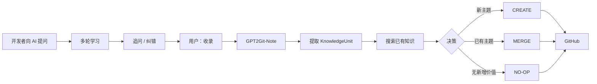

<div align="center">

# 🧠 GPT2Git-Note

### 把 AI 对话变成 Git-native 的开发者学习记忆

**对话 → 追问 → 误区 → 心智模型 → Git**

<p>
  
  
  
  
</p>

**不要保存聊天。保存你是怎么学会的。**

[English](README.en.md) · **简体中文**

[快速开始](#-快速开始) · [工作原理](#-工作原理) · [前后对比](#-前后对比) · [设计原则](#-设计原则) · [路线图](#-路线图)

</div>

---

## ✨ GPT2Git-Note 是什么？

GPT2Git-Note 是一个面向开发者学习场景的 Agent Skill。

你像平时一样和 AI 讨论 Java、数据库、分布式系统、Agent、RAG、算法或其他技术问题，不断追问，直到真正理解。最后只需要说一句：

```text
收录
```

GPT2Git-Note 会把这段学习过程整理成可长期维护的知识，并写入你的 GitHub Repository。

它保存的不是聊天流水，而是一个结构化的学习单元：

```text
KnowledgeUnit
├── 原始问题
├── 核心回答
├── 关键追问[]          ⭐
├── 错误理解[]          ⭐
├── 纠正过程[]
├── 最终心智模型
├── 面试回答?
└── 相关知识[]
```

> **真正值得保存的，不只是正确答案，还有你为什么没懂、你追问了什么，以及哪个解释最终让你想通。**

---

## 💡 为什么做这个？

越来越多开发者的学习过程其实是这样的：

```text
为什么 Spring 事务自调用会失效？
        ↓
AI 给出第一次解释
        ↓
但我明明是从 Proxy 进来的，为什么 this 还是 Target？
        ↓
继续解释
        ↓
那为什么依赖注入拿到的又是 Proxy？
        ↓
继续追问
        ↓
终于形成完整心智模型
```

传统方案往往有四个问题：

| 方式 | 问题 |
|---|---|
| 只保存 AI 最终答案 | 丢掉真正暴露认知缺口的追问 |
| 导出整段聊天 | 信息密度低，之后很难复习 |
| 手动整理 Obsidian / Notion | 学完以后还要再做一遍笔记劳动 |
| 每轮聊天生成一个 Markdown | 很快出现大量重复、碎片文件 |

GPT2Git-Note 的思路是：

> **让 AI 把学习过程编译成知识，让 Git 负责长期保存和演化。**

---

## 🔥 前后对比

### ❌ 原始聊天导出

```text
User: Spring 的 this.b() 为什么不走事务？
Assistant: 因为 Spring AOP...

User: 但我已经从 Proxy 进入 a() 了，为什么 this 不是 Proxy？
Assistant: 因为真正执行 a() 的对象还是 Target...

User: 那为什么 @Autowired 拿到的是 Proxy？
Assistant: 因为 Spring 最终暴露的是代理对象...
```

几个月以后重新打开，你需要重新读完整段对话才能恢复当时的思路。

### ✅ GPT2Git-Note

```markdown
# Spring 事务自调用为什么失效

## 1. 原始问题
为什么同一个类内部 this.b() 不会触发 @Transactional？

## 2. 核心回答
@Transactional 依赖 Spring AOP Proxy。
只有经过 Proxy 的调用才会执行事务增强。

## 3. 我的追问 ⭐

### 为什么已经从 Proxy 进入 a()，this 还是 Target？
Proxy 负责拦截和转发，但真正执行 a() 方法体的对象仍然是 Target。

### 为什么依赖注入拿到的却是 Proxy？
Spring 完成 AOP 包装后，对外暴露的是代理对象。

## 4. 我曾经的错误理解

❌ 从 Proxy 进入 a() 后，a() 内部的 this 应该也是 Proxy。

✅ 方法体最终运行在 Target 上，因此 this == Target。

## 5. 最终心智模型

Caller → Proxy → Target.a()
                  ↓
              this == Target
                  ↓
              Target.b()

## 6. 面试回答
...
```

完整示例：[`examples/spring-transaction-self-invocation.md`](examples/spring-transaction-self-invocation.md)

---

## ⚡ 快速开始

### 1. 正常学习

不需要改变你的提问方式：

```text
为什么 Kafka 吞吐量高？
```

继续追问：

```text
顺序写为什么快？
Page Cache 在这里做什么？
零拷贝到底少了哪几次复制？
如果磁盘已经很快，瓶颈会转移到哪里？
```

### 2. 学明白以后说一句

```text
收录
```

### 3. GPT2Git-Note 自动维护知识库

```text
当前学习对话
      ↓
提取 KnowledgeUnit
      ↓
搜索 GitHub 现有知识
      ↓
┌──────────┬──────────┬──────────┐
│  CREATE  │  MERGE   │  NO-OP   │
└──────────┴──────────┴──────────┘
      ↓
更新 Markdown
      ↓
GitHub Commit
```

你不需要在学习结束后再手动整理一次笔记。

---

## 🧭 工作原理



GPT2Git-Note 把 GitHub 当作 **Persistence Layer**，而不只是导出目标：

```text
Markdown     = Knowledge
Git History  = Knowledge Evolution
GitHub       = Persistence
AI Runtime   = Reasoning + Execution
Skill        = Knowledge Curator
```

V1 不需要自建数据库、向量库或同步服务。

---

## ⭐ 核心差异：追问是一等数据

大多数 AI 笔记工具更像：

```text
Question → Final Answer
```

GPT2Git-Note 更关注：

```text
Question
   ↓
Initial Answer
   ↓
Follow-up ⭐
   ↓
Misconception exposed ⭐
   ↓
Clarification
   ↓
Another Follow-up ⭐
   ↓
Final Mental Model
```

当内容必须压缩时，默认优先级是：

```text
1. 关键追问 + 解决这些追问的答案
2. 错误理解 + 纠正
3. 最终心智模型
4. 原始问题 + 核心回答
5. 补充示例
```

因为真正属于你的知识，不是网上随处可见的定义，而是：

> **你到底在哪一步卡住过。**

---

## 🔀 Git-native Merge

GPT2Git-Note 不会默认“一轮对话一个文件”。

每次写入之前，它先搜索已有知识，再做决策：

| 操作 | 什么时候使用 |
|---|---|
| **CREATE** | 没有合适的已有知识可以承载这次内容 |
| **MERGE** | 新对话深化了已经存在的知识点 |
| **NO-OP** | 新对话没有带来新的有效知识 |

### ❌ 笔记爆炸

```text
spring-transaction.md
spring-transaction-2.md
spring-transaction-final.md
spring-transaction-2026-08-30.md
```

### ✅ 持续演化的知识

```text
knowledge/java/spring.md

## Spring 事务
├── 自调用失效
├── rollbackFor
├── 传播机制
└── 事务失效场景
```

Git Commit 也可以成为认知版本：

```text
knowledge: add Spring transaction basics
knowledge: capture proxy-vs-target follow-up
knowledge: clarify self-invocation mental model
```

---

## 🗂️ 默认开发者知识分类

如果目标知识库没有自己的结构，可以从下面的默认分类开始：

```text
knowledge/
├── java/
│   ├── java-base.md
│   ├── jvm.md
│   ├── juc.md
│   └── spring.md
├── database/
│   ├── mysql.md
│   └── redis.md
├── middleware/
│   ├── kafka.md
│   └── mq.md
├── distributed-system/
│   └── fundamentals.md
├── ai/
│   ├── rag.md
│   ├── agent.md
│   ├── mcp.md
│   └── sandbox.md
└── algorithm/
    └── patterns.md
```

如果用户已有稳定的知识结构，Skill 应优先遵循现有结构，而不是强行迁移。

---

## 📦 安装

GPT2Git-Note 适用于能够读取 `SKILL.md` 的 Agent Runtime。要实现自动提交，还需要对应运行环境具备 GitHub 读写能力。

### 通用 Agent Skills 目录

```bash
git clone https://github.com/pogacar03/GPT2Git-Note.git \
  ~/.agents/skills/gpt2git-note
```

更新：

```bash
cd ~/.agents/skills/gpt2git-note
git pull
```

### Claude Code 风格目录

```bash
git clone https://github.com/pogacar03/GPT2Git-Note.git \
  ~/.claude/skills/gpt2git-note
```

### 其他 AI Runtime

如果环境支持 Project Instructions / Agent Skills：

```text
加载 SKILL.md
→ 允许 GitHub read / search / write
→ 指定目标知识仓库
```

> GitHub 自动持久化能力取决于具体运行环境。如果没有写权限，Skill 可以生成整理后的 KnowledgeUnit，但不能声称已经 Commit。

---

## 🧩 设计原则

<table>
<tr>
<td width="50%" valign="top">

### 🧠 Preserve cognition

保存“为什么没懂”和“怎么搞懂”，而不只是最终定义。

</td>
<td width="50%" valign="top">

### ⭐ Follow-ups first

用户追问是一等数据，不应该在摘要过程中被压掉。

</td>
</tr>
<tr>
<td width="50%" valign="top">

### 🔀 Merge before create

先搜索，再决定是否创建新知识，避免 Markdown 爆炸。

</td>
<td width="50%" valign="top">

### 🔒 Never invent

没有表达过的误解、经历或数据，不为了“笔记完整”而杜撰。

</td>
</tr>
<tr>
<td width="50%" valign="top">

### ✅ Verify Git writes

GitHub 写入成功以后才能说“已提交”。

</td>
<td width="50%" valign="top">

### 🧱 No backend by default

V1 直接利用 Agent + GitHub，不重复造数据库和同步服务。

</td>
</tr>
</table>

---

## 🆚 和传统笔记有什么不同？

| | 传统笔记 | Chat 导出 | GPT2Git-Note |
|---|---:|---:|---:|
| 自动整理 | ❌ | ✅ | ✅ |
| 保存最终答案 | ✅ | ✅ | ✅ |
| 保存关键追问 | 手动 | ✅ 但噪声大 | **✅ 一等数据** |
| 保存错误心智模型 | 手动 | 藏在聊天里 | **✅ 结构化** |
| 自动合并旧知识 | ❌ | ❌ | **✅** |
| Git 版本历史 | 可选 | ❌ | **✅ Native** |
| 需要额外数据库 | 视产品而定 | ❌ | **❌** |
| 数据归用户 | 视产品而定 | 视产品而定 | **✅ Git Repository** |

---

## 🏗️ Repository Structure

```text
GPT2Git-Note/
├── SKILL.md
├── references/
│   ├── knowledge-schema.md
│   ├── github-merge-protocol.md
│   └── developer-taxonomy.md
├── examples/
│   └── spring-transaction-self-invocation.md
├── tests/
│   └── skill-evals.md
├── docs/
│   └── superpowers/
│       └── specs/
├── CHANGELOG.md
├── README.md            # 默认简体中文
├── README.en.md         # English
└── README.zh-CN.md      # 兼容入口
```

---

## 🧪 行为测试

测试场景位于 [`tests/skill-evals.md`](tests/skill-evals.md)。

以下行为属于 release blocker：

- 丢失关键追问；
- 杜撰用户从未表达过的错误理解；
- 明明应该 MERGE 却不断创建新文件；
- 把原始聊天直接当成知识存储；
- GitHub 写入失败却声称“已提交”；
- 把无关的早期聊天污染进当前知识点。

---

## 🎯 V1 边界

GPT2Git-Note 当前刻意不引入：

- MCP Server
- 自建后端
- SQL Database
- Vector Database
- Browser Extension
- 后台同步服务

V1 只验证一个核心假设：

> **一句“收录”，能不能把一段真正有价值的 AI 学习过程，变成一个干净、持续演化的 GitHub 知识库？**

---

## 🗺️ 路线图

- [x] Git-native KnowledgeUnit
- [x] 关键追问优先级
- [x] CREATE / MERGE / NO-OP
- [x] English / 简体中文 README
- [ ] Knowledge mastery / weak-point tracking
- [ ] Review mode：根据历史误区自动生成复习问题
- [ ] PR mode：团队知识库审核
- [ ] 自动关联 Related Topics
- [ ] 根据 Git History 可视化知识演化
- [ ] Cross-runtime MCP layer
- [ ] 更多语言 README

---

## 🤝 Contributing

欢迎通过 Issue / PR 补充：

- 更好的学习对话 → KnowledgeUnit 示例；
- 容易让 Skill 丢失追问的压力测试；
- 不同开发领域的 taxonomy；
- Git merge / note merge 边界案例；
- 对 README 和安装方式的改进。

---

<div align="center">

### 🧠 GPT2Git-Note

**不要保存聊天。保存你是怎么学会的。**

[English](README.en.md) · **简体中文**

</div>